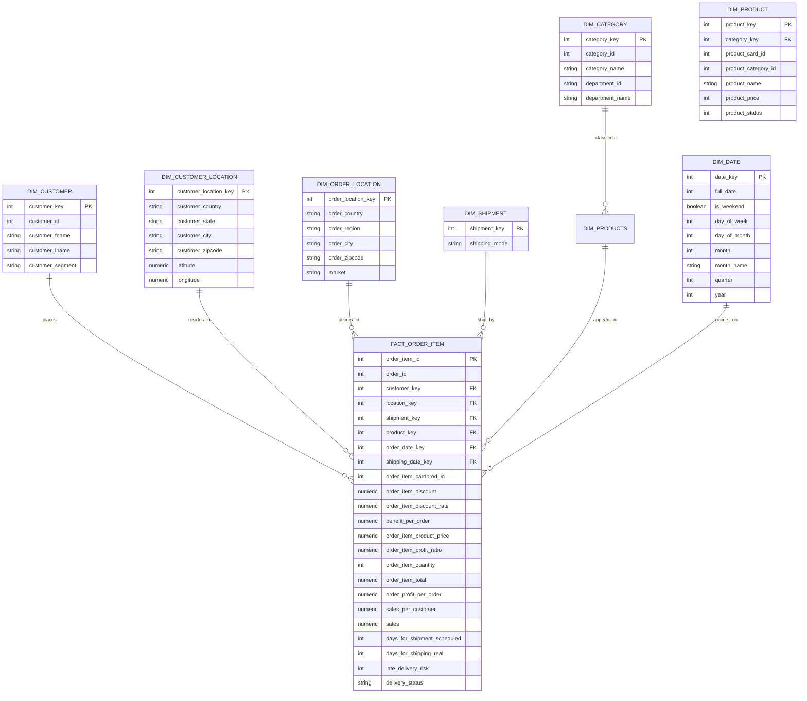

```mermaid
erDiagram
    DIM_CUSTOMER {
        int customer_key PK
        int customer_id
        string customer_fname
        string customer_lname
        string customer_segment
    }

    DIM_CUSTOMER_LOCATION {
        int customer_location_key PK
        string customer_country
        string customer_state
        string customer_city
        string customer_zipcode
        numeric latitude
        numeric longitude
    }
    DIM_ORDER_LOCATION {
        int order_location_key PK
        string order_country
        string order_region
        string order_city
        string order_zipcode
        string market
    }
    DIM_CATEGORY {
        int category_key PK
        int category_id
        string category_name
        string department_id
        string department_name
    }
    DIM_SHIPMENT  {
        int shipment_key PK
        string shipping_mode
    }
    DIM_PRODUCT {
        int product_key PK
        int category_key FK
        int product_card_id
        int product_category_id
        string product_name
        int product_price
        int product_status
    }
    DIM_DATE {
        int date_key PK
        int full_date
        boolean is_weekend
        int day_of_week
        int day_of_month
        int month
        string month_name
        int quarter
        int year
    }
    FACT_ORDER_ITEM {
        int order_item_id PK
        int order_id
        int customer_key FK
        int location_key FK
        int shipment_key FK
        int product_key FK
        int order_date_key FK
        int shipping_date_key FK 
        int order_item_cardprod_id                            
        numeric order_item_discount         
        numeric order_item_discount_rate 
        numeric benefit_per_order   
        numeric order_item_product_price    
        numeric order_item_profit_ratio     
        int order_item_quantity         
        numeric order_item_total            
        numeric order_profit_per_order
        numeric sales_per_customer
        numeric sales
        int days_for_shipment_scheduled
        int days_for_shipping_real
        int late_delivery_risk
        string delivery_status 
    }
DIM_CUSTOMER ||--o{FACT_ORDER_ITEM: places
DIM_CUSTOMER_LOCATION ||--o{FACT_ORDER_ITEM: resides_in
DIM_ORDER_LOCATION ||--o{FACT_ORDER_ITEM: occurs_in
DIM_SHIPMENT ||--o{FACT_ORDER_ITEM: ship_by
DIM_PRODUCTS ||--o{FACT_ORDER_ITEM : appears_in
DIM_DATE ||--o{FACT_ORDER_ITEM: occurs_on
DIM_CATEGORY ||--o{DIM_PRODUCTS: classifies
```